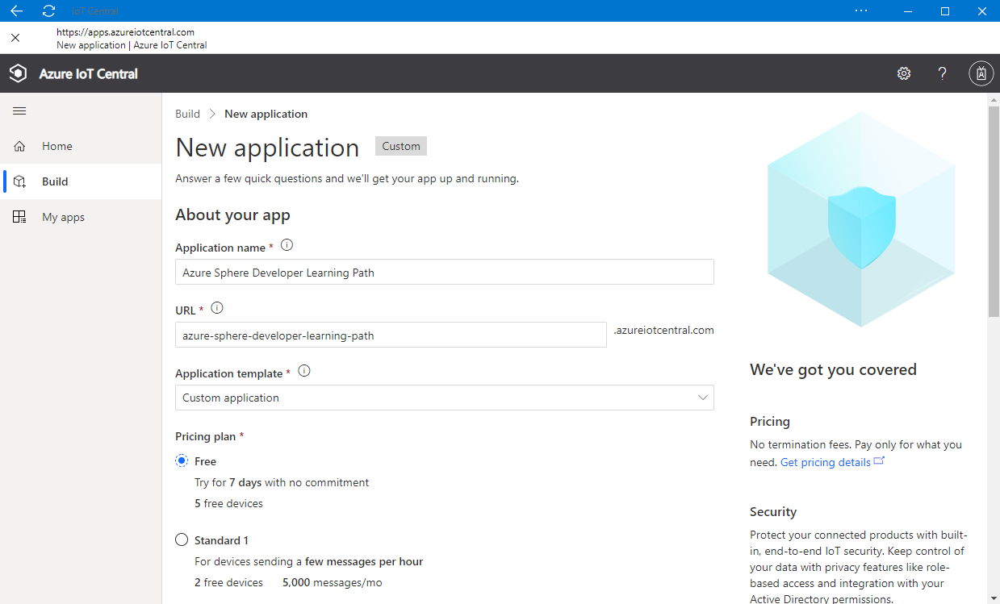
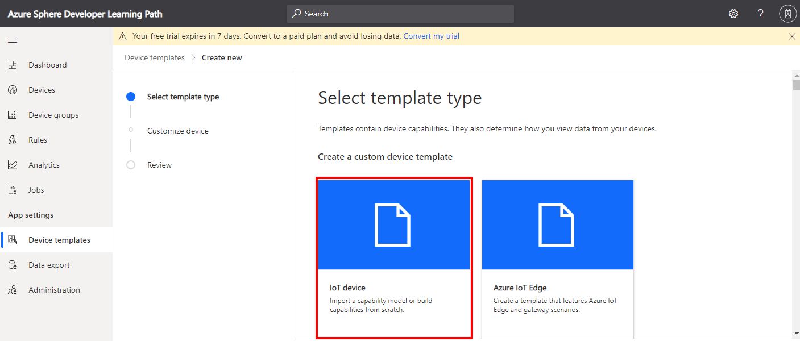
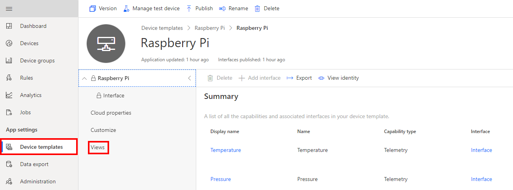
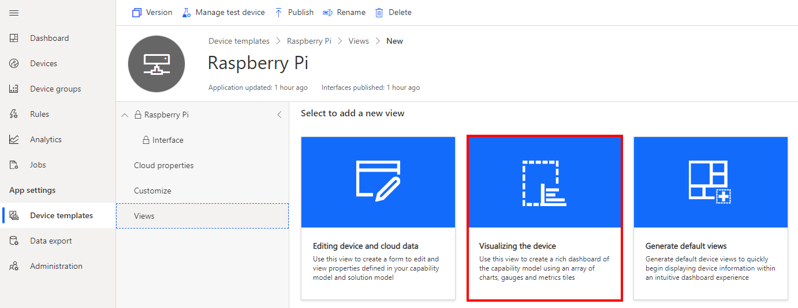
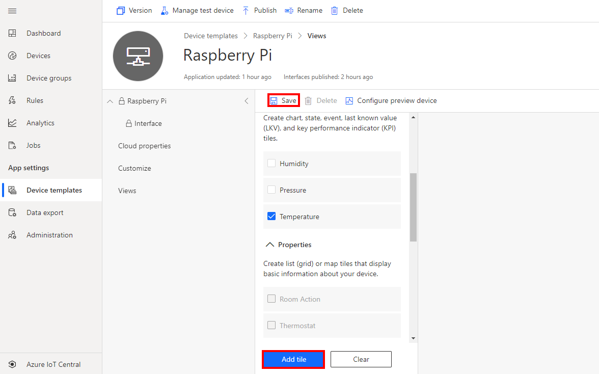
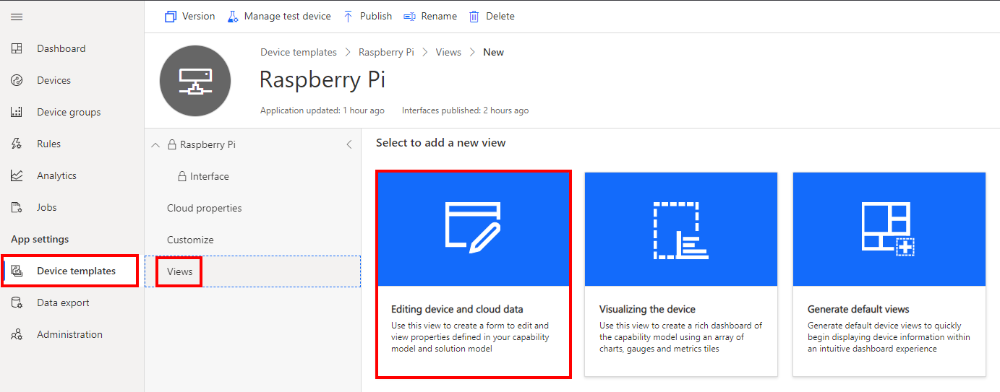
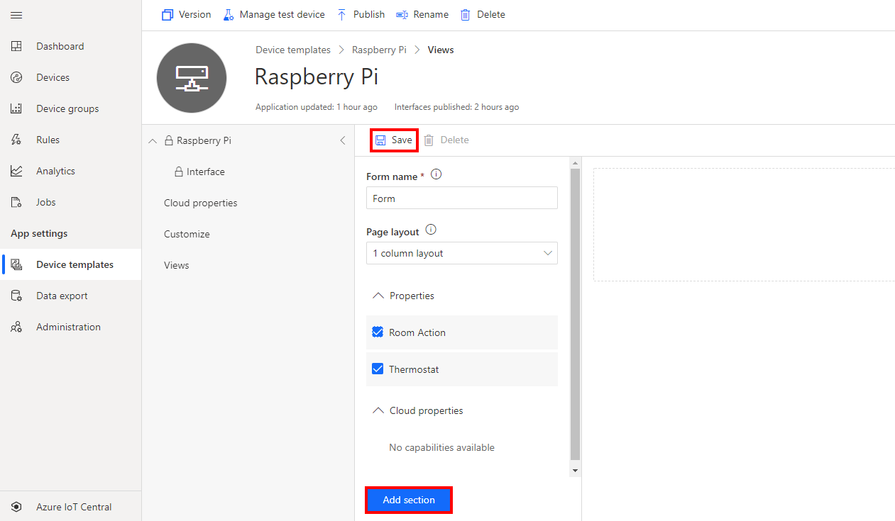
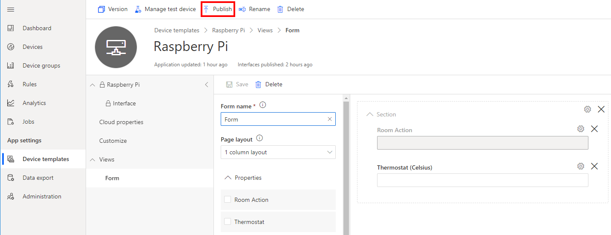
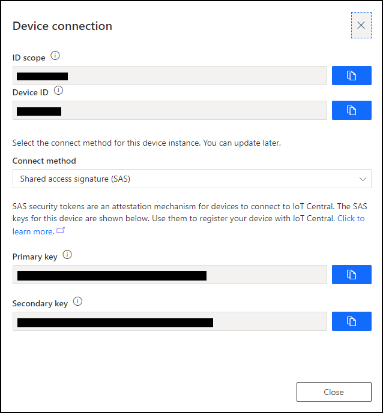
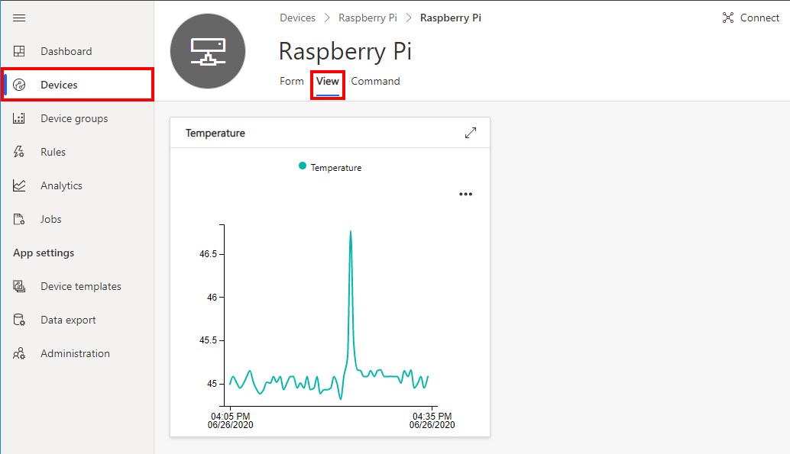

# Lab 2: Connect a room environment monitor to Azure IoT Central

<!--  -->

---

|Author|[Dave Glover](https://developer.microsoft.com/en-us/advocates/dave-glover?WT.mc_id=github-blog-dglover), Microsoft Cloud Developer Advocate, [@dglover](https://twitter.com/dglover) |
|:----|:---|
|Date| March 2020|

---

## Raspberry Pi .NET learning Path

Each module assumes you have completed the previous module.

[Home](../../README.md)

* Lab 1: [Create your  first Raspberry Pi .NET Core C# IoT Application](../labs/Lab_1_Build_dot_NET_Core_app/README.md)
* Lab 2: [Connect a room environment monitor to Azure IoT Central](../labs/Lab_2_Azure_IoT_Central/README.md)
* Lab 3: [Remote control the room temperature](../labs/Lab_3_IoT_Central_and_Device_Twins/README.md)

---

## What you will learn

You will learn how to build a Raspberry Pi application that connects and sends telemetry to [Azure IoT Central](https://azure.microsoft.com/services/iot-central/?WT.mc_id=github-blog-dglover).

---

## Prerequisites

The lab assumes you understand the content from [Lab 1: Build your first Raspberry Pi .NET Core Application](../Lab_1_Build_dot_NET_Core_app/README.md).


---

## Supported browsers for Azure IoT Central

We recommend that you use the most up-to-date browser that's compatible with your operating system. The following browsers are supported:

* Microsoft Edge (latest version). This means the **Chromium** version of the Microsoft Edge Browser
* Safari (latest version, Mac only)
* Chrome (latest version)
* Firefox (latest version)

[Supported browsers for Azure IoT Central](https://docs.microsoft.com/en-us/azure/iot-central/core/iot-central-supported-browsers)

## Tutorial Overview

1. How to create an Azure IoT Central Application
2. Configuring the Raspberry Pi Application to connect to Azure IoT Central.
3. Stream room temperature telemetry to IoT Central

---

## Key Concepts

### Azure IoT

Your Azure Sphere device can securely connect and communicate with cloud services. Azure Sphere includes built-in library support for both Azure IoT Hub and Azure IoT Central. This lab focuses on Azure IoT Central.

This project leverages the [Azure IoT Hub Device Provisioning Service (PDS)](https://docs.microsoft.com/en-us/azure-sphere/app-development/use-azure-iot?WT.mc_id=github-blog-dglover), which is included with Azure IoT Central. The Device Provisioning Service (DPS) enables zero-touch, just-in-time, large scale device provisioning.

Take a moment to read [Your IoT journey: simplified and secure with Azure IoT Central and Azure Sphere](https://techcommunity.microsoft.com/t5/internet-of-things/your-iot-journey-simplified-and-secure-with-azure-iot-central/ba-p/1404247).

---

## Azure IoT Central

[Azure IoT Central](https://azure.microsoft.com/en-in/services/iot-central/?WT.mc_id=github-blog-dglover) provides an easy way to connect, monitor, and manage your Internet of Things (IoT) assets at scale.


---

## Step 1: Create a new IoT Central Application

1. So the lab instructions are still visible, right mouse click, and open this link "[Azure IoT Central](https://azure.microsoft.com/en-au/services/iot-central/?WT.mc_id=pycon-blog-dglover)" in a new window.

2. Click **Build a solution**.

3. Next, you will need to sign with your Microsoft Personal, or Work, or School account. If you do not have a Microsoft account, then you can create one for free using the **Create one!** link.

    

4. Expand the sidebar menu by clicking on the **Burger menu** icon.

    

5. Click **+ New application** to create a new Azure IoT Central application. 

6. Select **Custom app**

    

### Create a new application

1. Specify the **Application name**, the **URL**, select the **Free** pricing plan, and complete the registration form. 

    

2. Then click **Create**.

### Create a new device template

A device template is a blueprint that defines the characteristics and behaviors of a type of device that connects to an Azure IoT Central application.

For more information on device templates, review the [Define a new IoT device type in your Azure IoT Central application](https://docs.microsoft.com/en-us/azure/iot-central/core/howto-set-up-template?WT.mc_id=github-blog-dglover) article. 

1. Click **Device templates**, then **+ New**.
    

2. Click the **IoT device** template type.

    

3. Create an **IoT Device** Template.

    1. Select **IoT device**,
    2. Click **Next:Customise**,
    3. Name your template **Raspberry Pi**,
    4. Click **Next: Review**,
    5. Click **Create**.

### Import a Capability Model

1. Click **Import capability model**
2. Navigate to the folder you cloned the Raspberry Pi Learning Path into.
3. Navigate to the **labs** directory.
4. Navigate to the **iot-central-template** directory
4. Select **RaspberryPiCapabilities.json** and open

### Create a device visualization view

1. Click **Views**.
    
2. Select **Visualizing the device**.
    
3. Select the **Temperature** telemetry item.
    
4. Click **Add Tile**.
7. Click **Save** to save the view.

### Create a properties form

1. Click **Views**.
2. Click the **Editing device and cloud data** option.
    
3. Expand the **Properties** section.
4. Select **all properties**.
    
5. Click **Add Section**.
6. Click **Save** to save the form.

### Publish the device template

1. Click **Publish** to publish the template. Publishing the template makes it available for devices.
    
    <br/>

2. Next, confirm and click **Publish**

>See [Define a new IoT device type in your Azure IoT Central application](https://docs.microsoft.com/en-us/azure/iot-central/core/howto-set-up-template?WT.mc_id=github-blog-dglover) for information on creating your own device templates.

---

## Start Lab 2

### Step 1 Open the command prompt on your computer

* **Linux** and **macOS** users start a new terminal command prompt.
* **Windows 10 WSL** users must start a [Windows Subsystem for Linux (WSL)](https://docs.microsoft.com/en-us/windows/wsl/install-win10) command prompt. Press <kbd>Windows</kbd>, type **wsl**, then press <kbd>Enter</kbd> to start a new Linux terminal command prompt.


### Step 2: Open the lab project

1. Change to the **raspberry-pi-dot-net-learning-path** directory
2. Change to the **samples** directory
3. Change to **dotnet.core.iot.csharp.dps.iot** directory
4. Start Visual Studio Code.

    ```bash
    code .
    ```

---

### Step 3: Sending telemetry to Azure IoT Central

Open **program.cs**, and scroll down to the **MeasureSensorHandler** function.

>Pro Tip. Use **Go to Symbol in Editor** in Visual Studio Code. Use the keyboard shortcut <kbd>Ctrl+Shift+O</kbd> and start typing *SendMsgIotHub*.

In the **SendMsgIotHub** method, the telemetry is serialised to JSON and then sent to Azure IoT.

```csharp
private static async Task SendMsgIotHub(DeviceClient iotClient, double temperature)
{
    var telemetry = new Telemetry() { Temperature = Math.Round(temperature, 2), MessageId = _msgId++ };
    string json = JsonConvert.SerializeObject(telemetry);

    Message eventMessage = new Message(Encoding.UTF8.GetBytes(json));

    await iotClient.SendEventAsync(eventMessage).ConfigureAwait(false);
}
```

---

## Configuring the IoT Central Device Connection

### Step 1: Display the IoT Central device connection

1. Switch back to IoT Central in your browser.
2. Navigate to the device you created
3. Click on **Connect**
    

### Step 2: Configure the project environment file

1. Switch back to Visual Studio Code
2. Open the **.env** file
3. Update the .env file with the connection information from IoT Central

    ```conf
    DPS_IDSCOPE="<Replace with your IoT Central ID Scope>"
    DPS_REGISTRATION_ID="<Replace with your IoT Central Devic ID>"
    DPS_PRIMARY_KEY="<Replace with your IoT Central Primary key>"
    DPS_SECONDARY_KEY="<Replace with your IoT Central Secondary key>"
    ```

4. You will want these environment settings in Lab 3 so save a copy of the .env file to Notepad or similar text editor on your computer.

---

## Deploy the app to the Raspberry Pi

### Step 1: Start the app build deploy process

1. From Visual Studio Code, press <kbd>F5</kbd> to build, deploy, start, and attached the remote debugger to the application now running the Raspberry Pi.

---

## Step 2: View the device telemetry on the Azure IoT Central Dashboard

1. Switch back to Azure IoT Central in your web browser.
2. Click **Devices** on the sidebar.
3. Select the **Raspberry Pi** template.
4. Select your Raspberry Pi device
4. Select the **View** tab to view the device telemetry.

> Azure IoT Central does not update immediately. It may take a minute or two for the temperature, humidity, and pressure telemetry to be displayed.



---

## In Review

We learned the following:

1. How to create an Azure IoT Central Application
2. Configuring the Raspberry Pi Application to connect to Azure IoT Central.
3. Stream room temperature telemetry to IoT Central

---

## Close Visual Studio

Now close **Close Visual Studio**.

---

## Finished 完了 fertig finito समाप्त terminado

Congratulations you have finished Lab 2.


---

**[NEXT](../Lab_3_Control_Device_with_Device_Twins/README.md)**

---
